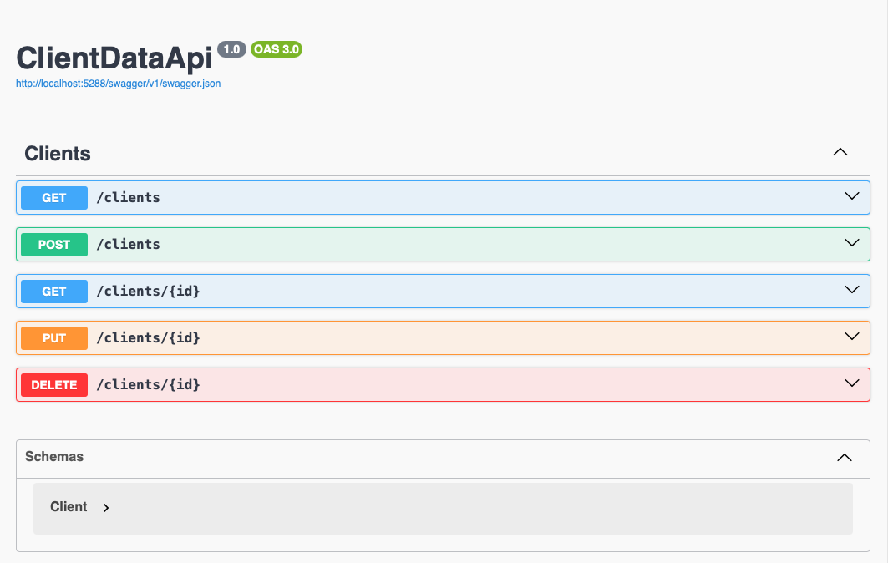
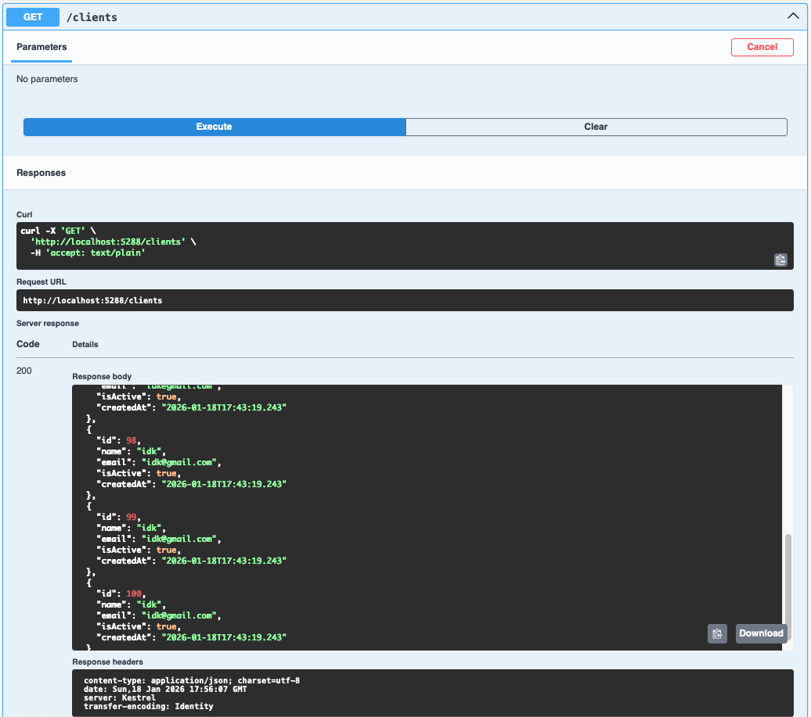

# Basic Dotnet Database

## Uses Swagger UI to display simple information. The initial setup shown here takes a basic example provided by Dotnet.

### Initial UI with client API:

So far, the initial project is set up as follows:
- Add new dotnet webapi
- Add EntityFrameworkCore, EntityFrameworkCore.Sqlite and EntityFrameworkCore.Tools
- Create client program to get and set client data, sets up columns of one row in the table kind of
- Create database context program for talking between C# and SQL, entityframeworks handles this well, also requires editing appsettings.json file and adding the context in Program.cs
- Create database using dotnet-ef for migration which generates SQL commands for our C# code and keeping track of database structure
- Add API controller to give methods for http requests to C# requests
- Replace boilerplate code with client data
