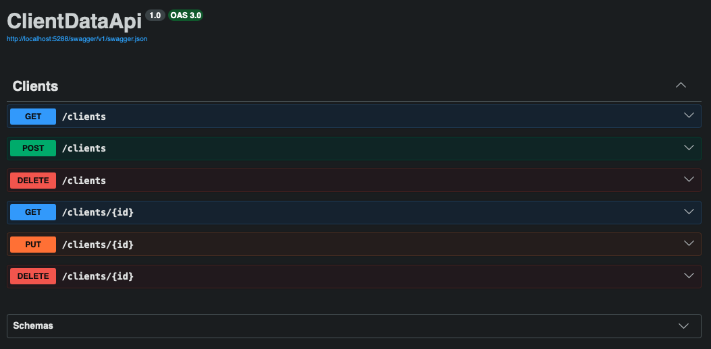
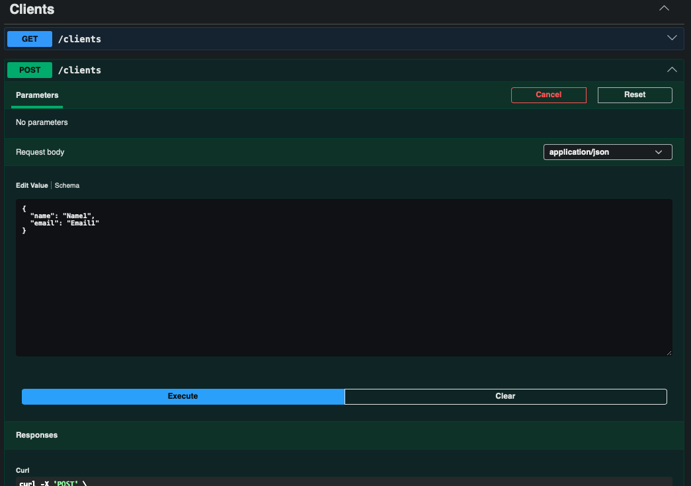
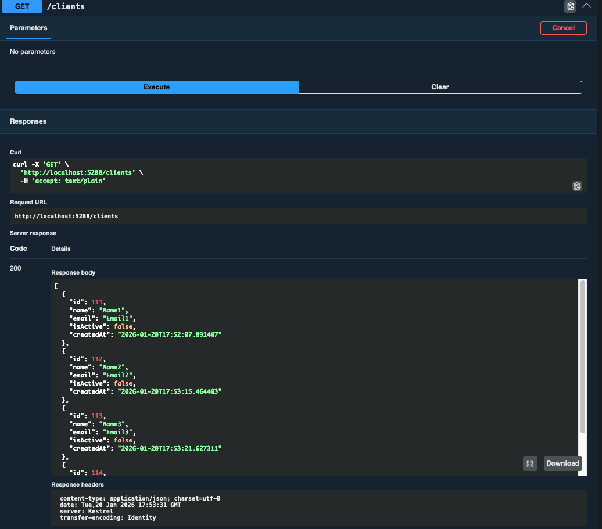
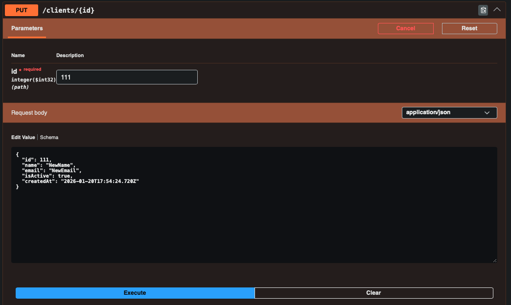
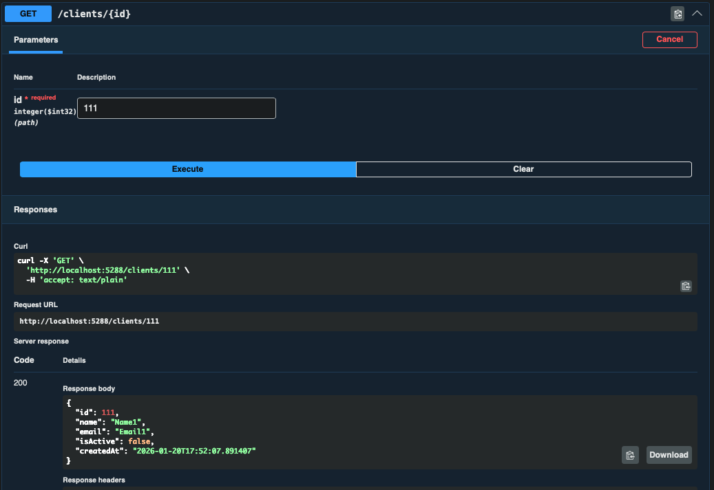
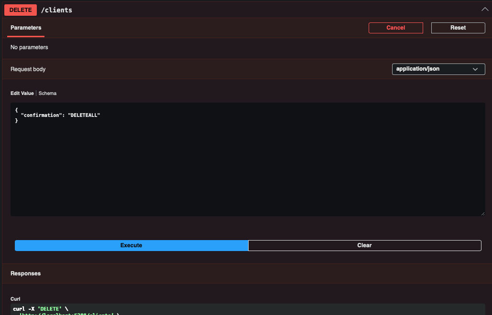

# Basic Dotnet Database

## Uses Swagger UI to display simple information. The initial setup shown here takes a basic example provided by Dotnet.

### UI with client API:
This is a barebone sproject so the user has access to all the data and can change it however they wantbut has quite a bit on control over the data and that was the intention.

####(1) Overall UI
This is just how the run local host looks.

####(2) Add Item
This function allows the user to edit a json file for input to the database, they cna only change the name and email, IDs are indexed by the system automatically.

####(3) Get All
Displays list of all entries in database ordered by index.

####(4) Edit Item
Edit an entry's json file. Please dont edit the index by the way.

####(5) Get All Post Edit
All entries after the edit. Note index 111 has been updated.

####(6) Get Specific ID
Displays data of chosen id. 

####(7) Delete All
Delete all entries in database, requires text confirmation. 

The project steps included:
- Add new dotnet webapi
- Add EntityFrameworkCore, EntityFrameworkCore.Sqlite and EntityFrameworkCore.Tools
- Create client program to get and set client data, sets up columns of one row in the table kind of
- Create database context program for talking between C# and SQL, entityframeworks handles this well, also requires editing appsettings.json file and adding the context in Program.cs
- Create database using dotnet-ef for migration which generates SQL commands for our C# code and keeping track of database structure
- Add API controller to give methods for http requests to C# requests
- Replace boilerplate code with client data
- Add validation, logging and DelteAll function

## Requirements
- .NET SDK 8+ (tested with .NET 10 preview)

No external services are required. The project runs fully locally using SQLite.

## Running the project

1. Clone the repository
2. Navigate to the project directory
3. Run:

   dotnet run

4. Open Swagger UI at:
   http://localhost:<port>/swagger

On first run, the application will:
- Create a local SQLite database file
- Apply Entity Framework migrations automatically

